# Planification des tests

## **Cahier de recettes**

### **I - Introduction et contexte :**

L’application Cinetech permet à un utilisateur de créer un compte, de se connecter et de gérer sa session.  
L’utilisateur peut ensuite consulter une liste de films et de séries provenant d’une API externe.   
De plus, il a la possibilité d’ajouter ou de supprimer des films et séries de ses favoris étant associés uniquement à son compte.  
Le système empêche l’ajout en doublon et garantit que les favoris d’un utilisateur ne soient pas accessibles par un autre.  
L’utilisateur peut également poster, répondre et supprimer des commentaires. La suppression comprend aussi le retrait des réponses au commentaire supprimé.  
La suppression n’est possible que par l’auteur du commentaire.  
Enfin, l’application doit être utilisable en respectant les normes d’accessibilité (navigation, contraste, etc).

### II - Objectif des tests :

Les fonctionnalités suivantes seront testées pour s’assurer de la bonne marche du site afin de fournir une application web fonctionnelle et efficace et de rassurer le client.

### **III - Liste des fonctionnalités à tester :**

1 - Connexion utilisateur :

L’application doit permettre à un utilisateur de créer un compte en remplissant un formulaire avec un email et un mot de passe. Le système vérifie l’existence de l’email dans la base de données et renvoie un message approprié selon le résultat. Une fois inscrit, l’utilisateur peut se connecter avec ses identifiants et est redirigé vers sa page profil.

- Vérification de l’existence de l’adresse email dans le base de données
    - Cas attendus
        1. Si l’email existe déjà : erreur : “Cet email existe déjà”
        2. Si l’email n’existe pas : succès : “Inscription réussie”
- Inscription et Connexion :
    - Inscription d’un utilisateur (email, mot de passe, confirmation du mot de passe)
        1. Si le formulaire est bien rempli : succès : “Inscription réussie vous pouvez vous connecter “
        2. Si l’email est invalide : erreur
        3. Si l’email existe déjà : erreur : “Cet email existe déjà”
        4. Si les mots de passe ne correspondent pas : erreur : “Les mots de passe ne correspondent pas.”
    - Connexion de l’utilisateur (email et mot de passe)
        1. Si les identifiant sont corrects, l’utilisateur est connecté et est redirigé vers sa page profil
        2. Si les identifiants ne correspondent pas, un message d’erreur apparaît  : “Email ou mot de passe incorrect”.

2 - Gestion des favoris :

Un utilisateur authentifié peut ajouter des films ou séries à ses favoris, les retirer et consulter sa liste. Le système empêche l’ajout de doublons.

- Ajout d’un favori
    1. Succès : “Ajouté aux favoris avec succès”
    2. Erreur : “Cet élément existe déjà dans vos favoris”
- Retrait d’un favori
    1. Succès : “Favoris retiré avec succès”
    2. Erreur : “Erreur lors de la suppression du favori”
- Récupération des favoris
    1. Succès : “Favoris récupérés avec succès”
    2. Erreur : “Erreur lors de la récupération des favoris”
- Ajout et/ou Retrait d’un favori + Récupération des favoris
    1. Succès : “Ajouté aux favoris avec succès”/”Retiré des favoris avec succès” + “Favoris récupérés avec succès”
    2. Erreur : “Erreur lors de l’ajout/retrait du favori”
    3. Erreur : “Erreur lors de la récupération des favoris”

3 - Gestion des commentaires :

Les utilisateurs peuvent poster, répondre et supprimer leurs commentaires. La suppression inclut également toutes les réponses associées.

- Ajouter un commentaire
    1. Succès : “Commentaire ajouté avec succès”
    2. Erreur : “Erreur lors de l’ajout du commentaire”
- Ajout et/ou suppression d’un commentaire et de toutes les réponses associées + Récupération de tous les commentaires
    1. Succès : “Ajout/Suppression du commentaire avec succès” + “Récupération des commentaires avec succès”
    2. Erreur : “Erreur lors de l’ajout/suppression du commentaire” 
    3. Erreur : “Erreur lors de la récupération des commentaires”

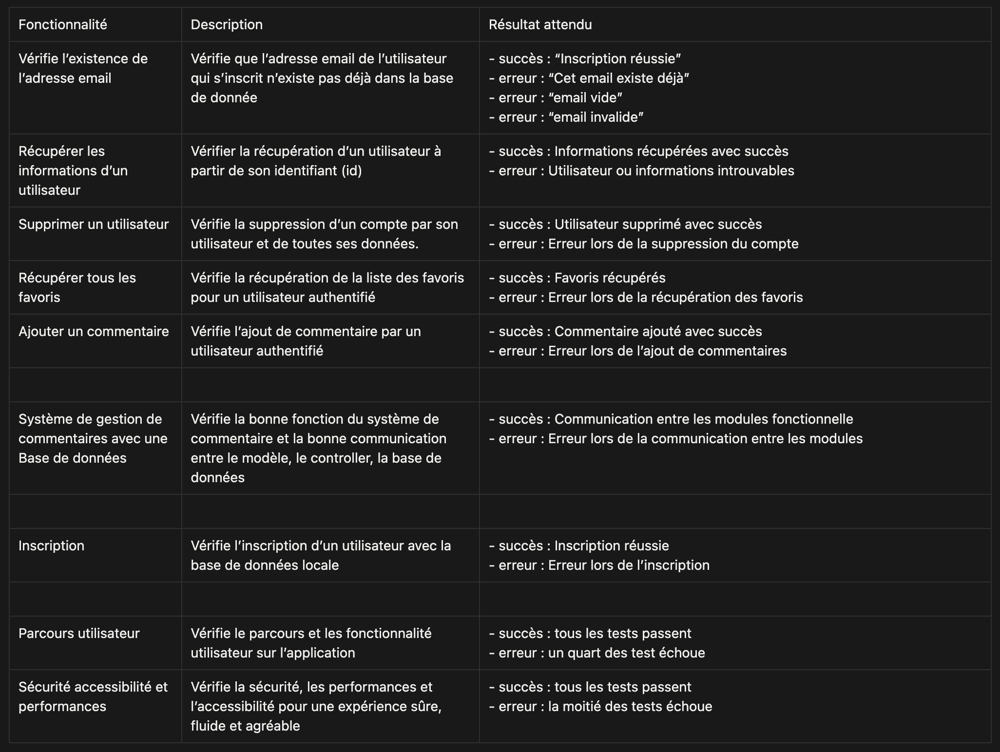

---

---

---

# **Stratégie de test :**

- Types de tests à appliquer (unitaires, intégration, fonctionnels).
- Outils utilisés (PHPUnit, Vitest, Jest, Cypress, etc.).
- Niveaux de couverture attendus.

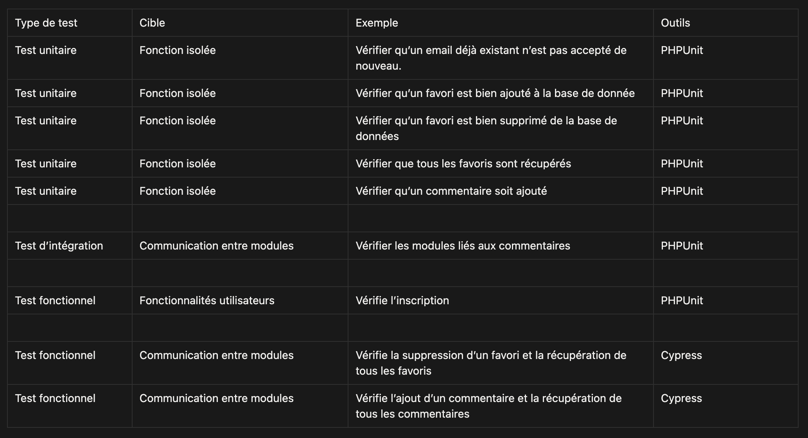

---

---

---

# **Plan de test :**

- ID du test
- Fonctionnalité concernée
- Pré-conditions
- Étapes à suivre
- Résultat attendu

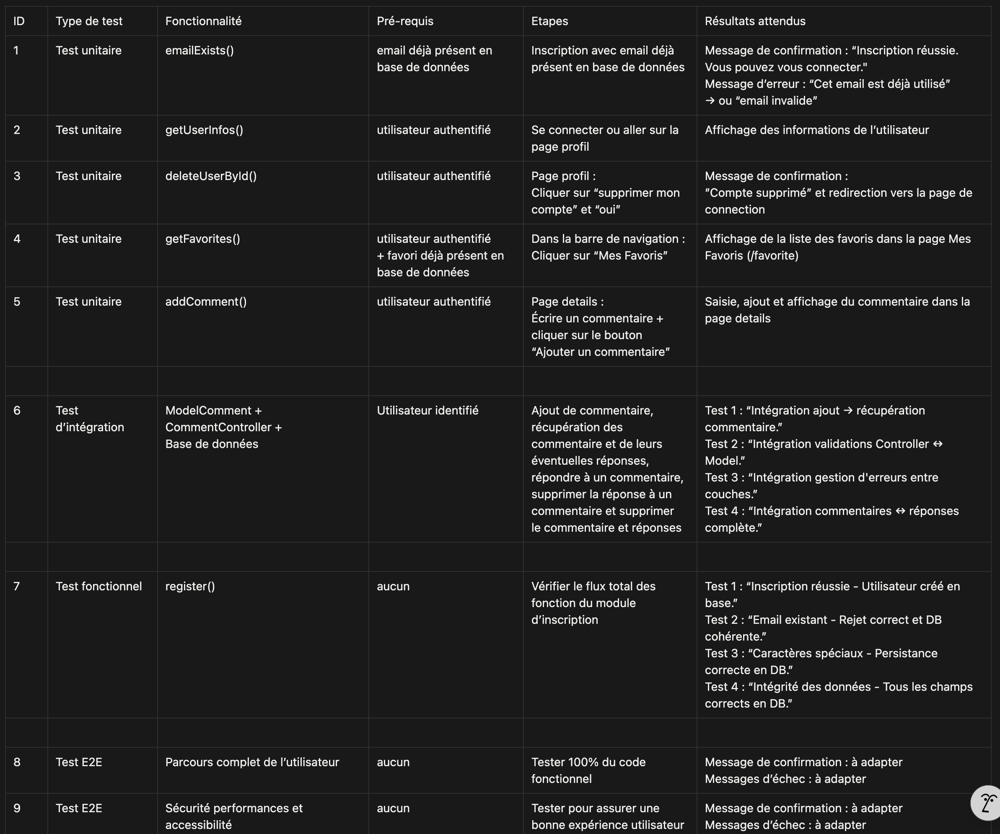

---

---

---

# **Rapport des Tests :**

- Critères de complétion :
    - Taux de réussite :
        - Au moins 95% des tests basiques passés avec succès
        - 100% des tests critiques passés avec sucsès
        - Tests réalisés avec PHPUnit et Cypress
    - Performances :
        - Temps de chargement des pages < 3s

**Date :** le 19/09/2025

**Responsable des tests :** LADMIA Ryan

**Objectifs :** 

Vérifier les fonctionnalités, l’intégration, la performance, la sécurité et l’expérience utilisateur.  

**Résumé :**

Cas de Tests exécutés : 72.  
Cas de test réussi : 72.  
Cas de test échoué : 0.  
Pourcentage de tests réussis : 100%.  
Pourcentage de test échoué : 0%.  

**Analyse des tests :**

Les tests ont révélés que les fonctionnalité critique s’exécutaient correctement et permettaient d’offrir à un utilisateur une application performante et accessible.  
Des corrections peuvent être ajouté pour optimiser davantage la sécurité et l’apparence.

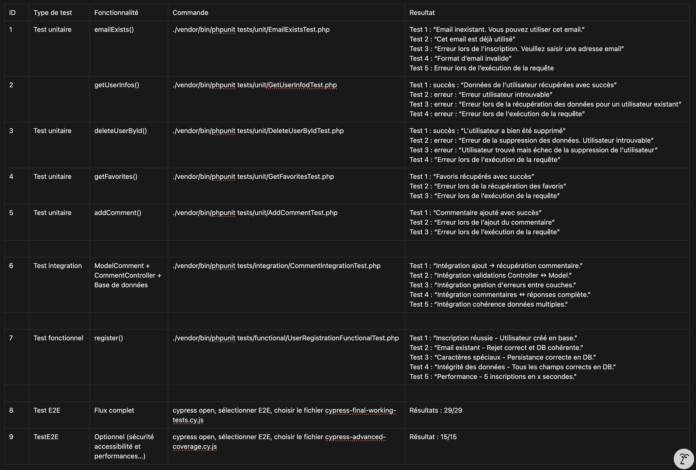

## Terminal : 

### Tests unitaires

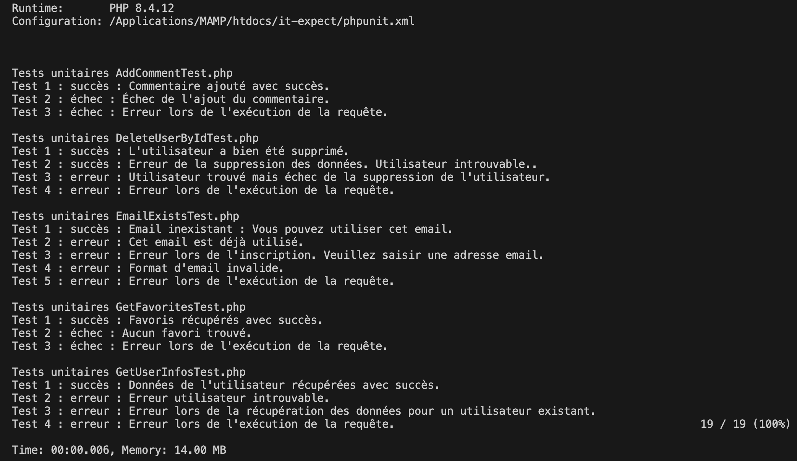

### Tests d'intégration

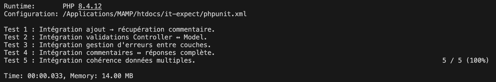

### Tests fonctionnels 

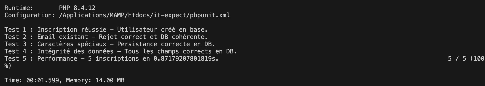

### Tests E2E :

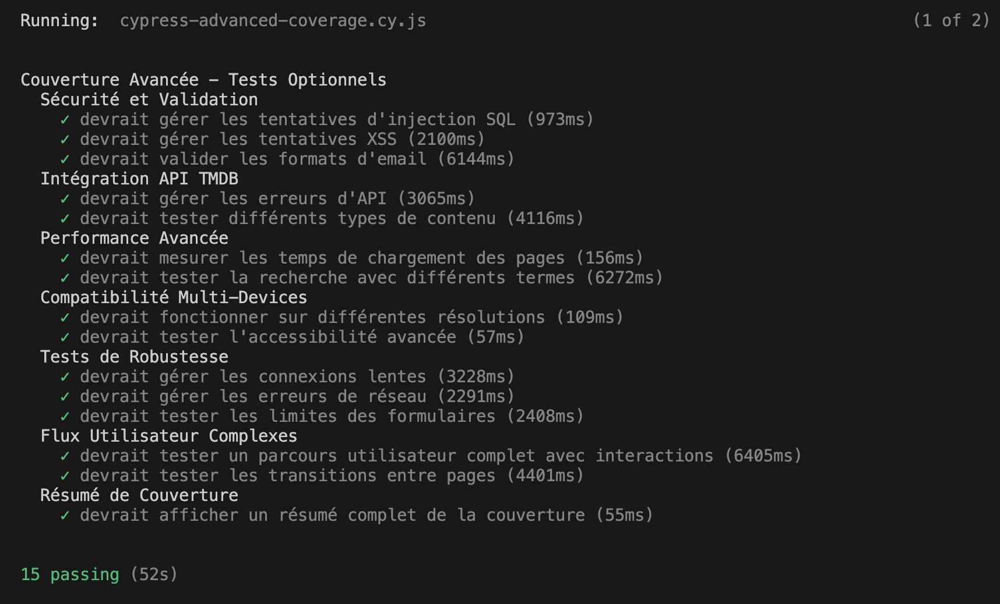
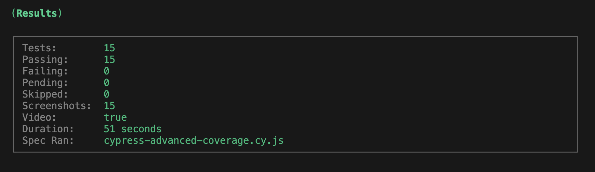
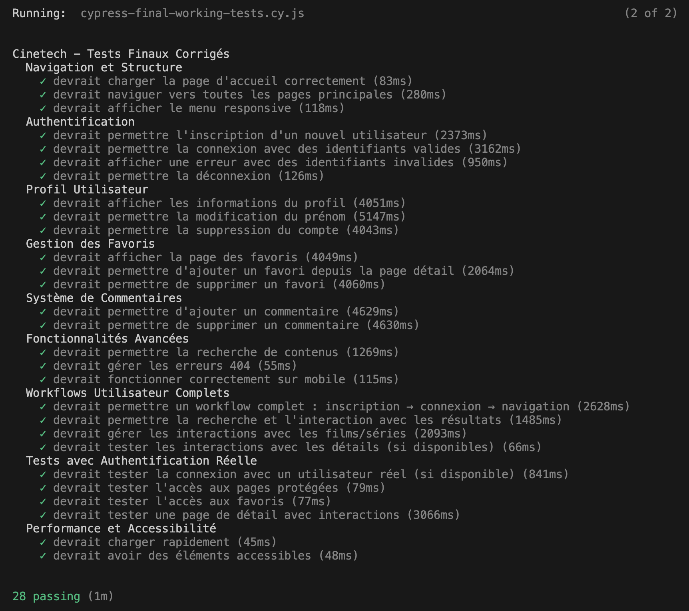
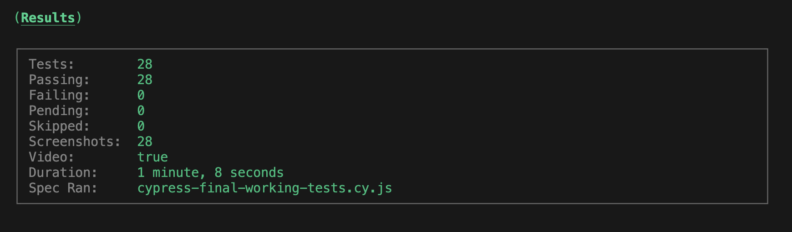
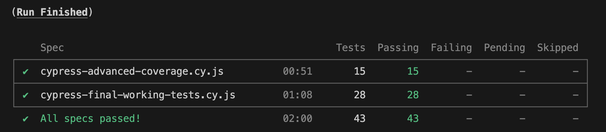

